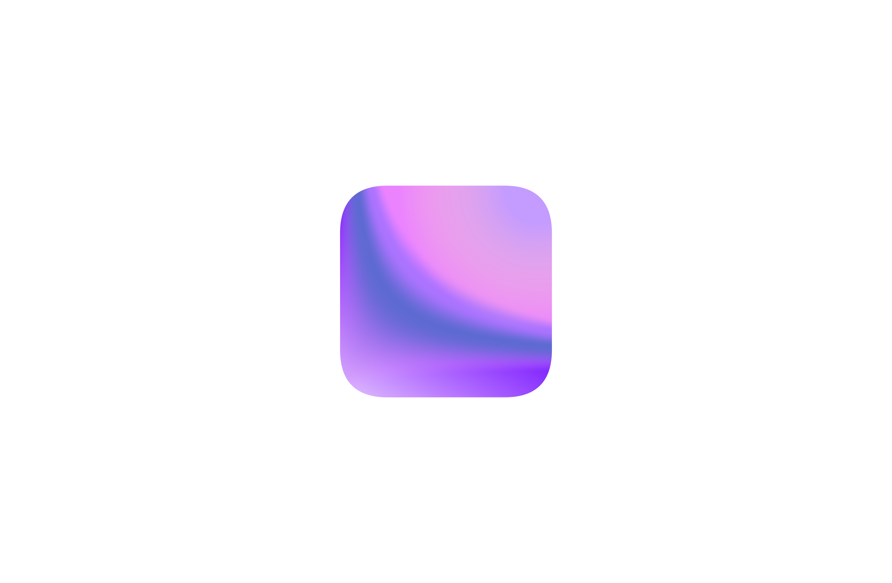

# sublinear

How to use 
1. make sure your database is in `workspace`

INSIDE 

GraphQL - a query language for APIs and a runtime for fulfilling those queries with your existing data.
NodeJS
TypeScript
- Express
GraphQL server: 
React JS
Apollo 

LINEAR ENDPOINT :  `https://api.linear.app/graphql`


TODO 

- create endpoint 
- create-react-apollo-typescript

SET UP: 

Next, initialize a TypeScript project to it:
`npm init -y
npm install typescript ts-node @types/node --save-dev
`
1. TypeScript 
2. 


  

```graphql
node: https://github.com/connor/linear-node-api
``` 


<ul><ul>
    <b>Sublinear.</b><br/>
    This fetches data, and displays them on Notion. It lets you export your tasks on Linear to <a href="https://www.notion.so/">Notion</a> dynamically.
 
</ul></ul>


<ul><ul>
    <b>Linear</b><br/>
    Linear helps streamline software projects, sprints, tasks, and bug tracking. It's built for high-performance teams.
  <br/> <a href="https://linear.app/">Linear</a> 
</ul></ul>


<ul><ul>
    <b>Notion</b><br/>
    The official Notion API allows users to populate their workspaces and database with external resources. 
  
</ul></ul>

 

</ul></ul>